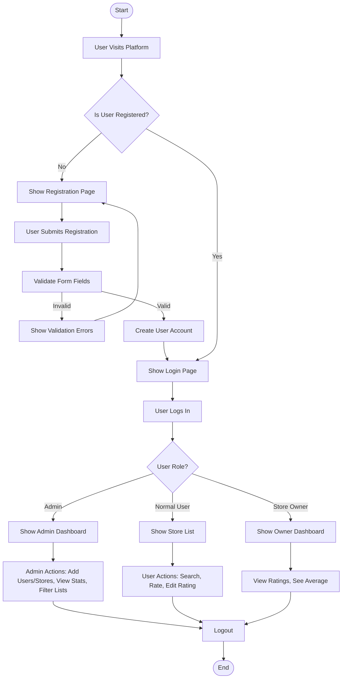

# Store Rating Platform

---

## 🚀 Quick Start: How to Run This Project

1. **Download the Repository**
   - Go to the my repository link (GitHub page).
   - Click the green <kbd>Code</kbd> button and select "Download ZIP".
   - In your Downloads folder, right-click the ZIP file and select **Extract All**.
   - Click **Extract**.
   - Right-click the extracted folder and choose **Open with Code** (VS Code).

2. **Open Terminal in VS Code**
   - Click on **Terminal** > **New Terminal**.

3. **Check Prerequisites**
   - Run:
     ```bash
     node -v
     npm -v
     mysql --version
     ```

4. **Navigate to Project Directory**
   - Run:
     ```bash
     ls
     cd Store_Rating_Platform_Project_Task-main
     ls
     ```
   - Ensure you see folders/files like: `public`, `src`, `eslint.config.mjs`, `next-env.d.ts`, etc.

5. **Install Dependencies**
   - Run:
     ```bash
     npm install
     ```

6. **Setup MySQL Database**
   - Run:
     ```bash
     mysql -u root -p
     # Enter password: root (or your MySQL root password) 
     # Dtabase name must be ( abc )
     CREATE DATABASE abc;
     SHOW DATABASES;
     EXIT;
     ```

7. **Initialize Database Tables**
   - Run:
     ```bash
     npx tsx init-db.ts
     # (Enter 'y' for yes if prompted)
     ```


8. **Start the Application**
   - Run:
     ```bash
     npm run dev
     ```
   - Visit [http://localhost:3000](http://localhost:3000) in your browser.

---

## ⚠️ Admin First Login Note

> **NOTE:** The main admin account is seeded by default.
> 
> **Seed user:** `admin@storerating.com`  
> **Password:** `Admin@123`
> 
> **For security reasons, please update your password upon your first login as an admin.**

---

A full-stack web application designed for store ratings.
This project uses **Next.js** for the frontend and a custom **Express.js** API for the backend, communicating with a **MySQL** database via raw SQL queries (Prisma ORM has been completely removed).


## FullStack Intern Coding Challenge

### Tech Stack

● Frontend: ReactJs
● Backend: ExpressJs 
● Database: MySQL  


### Requirements

We need a web application that allows users to submit ratings for stores registered on the platform. The ratings should range from 1 to 5.

A single login system should be implemented for all users. Based on their roles, users will have access to different functionalities upon logging in.

Normal users should be able to sign up on the platform through a registration page.

#### User Roles
1. System Administrator
2. Normal User
3. Store Owner

#### Functionalities

**System Administrator**
- Can add new stores, normal users, and admin users.
- Has access to a dashboard displaying:
   - Total number of users
   - Total number of stores
   - Total number of submitted ratings
- Can add new users with the following details:
   - Name
   - Email
   - Password
   - Address
- Can view a list of stores with the following details:
   - Name, Email, Address, Rating
- Can view a list of normal and admin users with:
   - Name, Email, Address, Role
- Can apply filters on all listings based on Name, Email, Address, and Role.
- Can view details of all users, including Name, Email, Address, and Role.
   - If the user is a Store Owner, their Rating should also be displayed.
- Can log out from the system.

**Normal User**
- Can sign up and log in to the platform.
- Signup form fields:
   - Name
   - Email
   - Address
   - Password
- Can update their password after logging in.
- Can view a list of all registered stores.
- Can search for stores by Name and Address.
- Store listings should display:
   - Store Name
   - Address
   - Overall Rating
   - User's Submitted Rating
   - Option to submit a rating
   - Option to modify their submitted rating
- Can submit ratings (between 1 to 5) for individual stores.
- Can log out from the system.

**Store Owner**
- Can log in to the platform.
- Can update their password after logging in.
- Dashboard functionalities:
   - View a list of users who have submitted ratings for their store.
   - See the average rating of their store.
- Can log out from the system.

#### Form Validations
- Name: Min 20 characters, Max 60 characters.
- Address: Max 400 characters.
- Password: 8-16 characters, must include at least one uppercase letter and one special character.
- Email: Must follow standard email validation rules.

#### Additional Notes
- All tables should support sorting (ascending/descending) for key fields like Name, Email, etc.
- Best practices should be followed for both frontend and backend development.
- Database schema design should adhere to best practices.

---

## Tech Stack

● Frontend: ReactJs
● Backend: ExpressJs 
● Database: MySQL  

- **Running tools**: `concurrently` (runs frontend and backend together)

---

## Prerequisites

1. **Node.js** (v18 or higher recommended)
2. **MySQL Server** installed and running on `localhost:3306`.
3. A local MySQL database named **`abc`**.
   - Default credentials expected in `src/lib/db.ts`: User: `root`, Password: `root`.

---

## Setup & Installation

**1. Install dependencies**

```bash
npm install
```

**2. Initialize the Database**
This script will automatically create the required tables (`User`, `Store`, `Rating`).

```bash
npx tsx init-db.ts
```


---

## Running the Application

To start both the Next.js frontend (port 3000) and the Express backend (port 3001) simultaneously:

```bash
npm run dev
```

The application will be accessible at: [http://localhost:3000](http://localhost:3000)

---

## Test Credentials

Use these credentials to test the various roles in the application. (Password for all is `Admin@123`)

| Role            | Email                   | Password    |
| :-------------- | :---------------------- | :---------- |
| **Admin**       | `admin@storerating.com` | `Admin@123` |
| **Store Owner** | `owner@storerating.com` | `Admin@123` |
| **User**        | `user@storerating.com`  | `Admin@123` |

---

## Recent Architectural Changes

- **Removed Prisma**: The project was migrated away from Prisma ORM to raw `mysql2` promises for better control over SQL execution.
- **Express Backend**: Replaced Next.js App Router API routes with a dedicated Express.js backend (`server.ts`).
- **Development Proxy**: Next.js automatically proxies `/api/*` requests to the Express server running on port `3001` to prevent CORS issues.


---

## 🔄 Logic Flowchart


